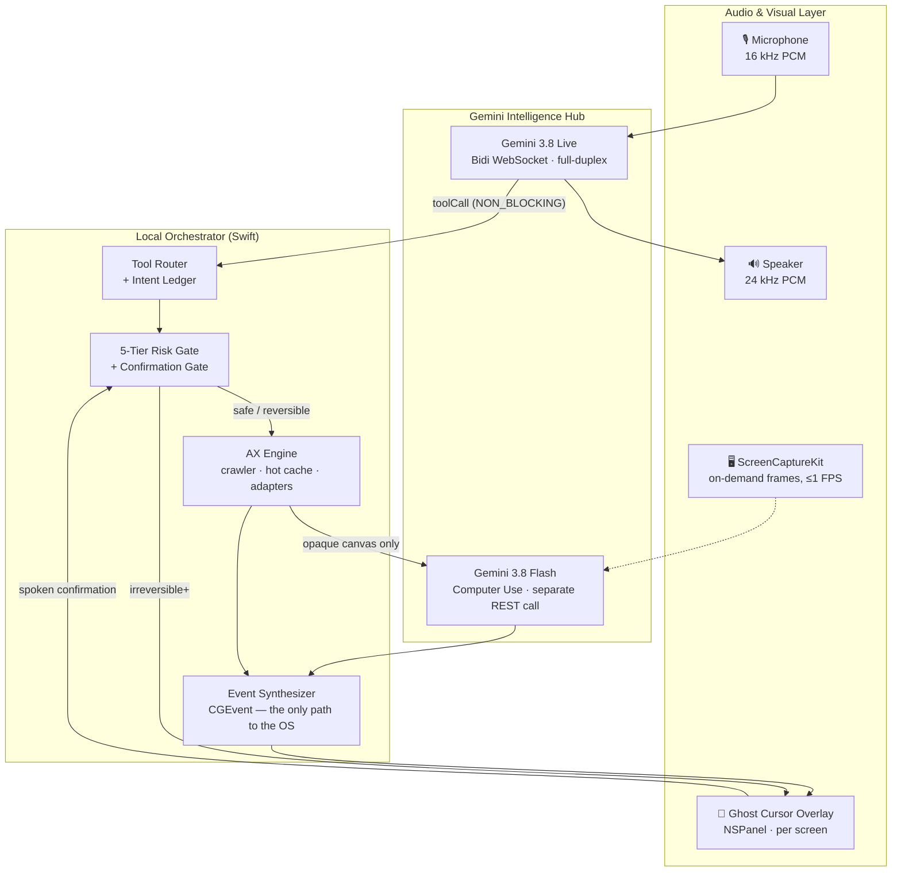

<div align="center">

# Clicky

**A voice-first AI cursor for macOS.**  
Speak naturally in English, Hindi, or Marathi — Clicky shows you what it will do before it does it, and asks before it acts.


*Built for the CraftVerse 2.0 Hackathon (PCCOE&R Pune) — Agentic AI track.*

**📐 [System design specification](docs/superpowers/specs/2026-10-05-clicky-voice-ai-cursor-design.md) · 📋 [Research & validation](docs/research) · 🗺️ [Roadmap](#roadmap)**

</div>

---

> **Project status (2026-10-06): pre-alpha.** The system design is complete and has survived five independent research/validation passes. Implementation is under way in reviewed chunks — Chunks 1–12 have landed: the package graph + tested foundation math; the menu-bar shell with the permission wizard and signed `.app` bundle; the Gemini wire-protocol layer with byte-exact offline fixtures and the transport seam; the Gemini Live client core with `setupComplete` gating, non-blocking tool dispatch, fail-closed cancellation, and hybrid-VAD end-of-speech; Gemini resilience — resumable session caching, `goAway`/transport-loss reconnect with backoff and fresh-session fallback, local mock mode replaying the demo scenario through the real dispatch path, and the day-0 live API spike; the Accessibility engine (budgeted crawler, hot cache, app adapters); input synthesis (Unicode-safe keystrokes, panic release); the 5-tier safety gates; audio capture + the energy-onset local stop; and the VoiceProcessingIO audio engine with 20 ms PCM chunks, adaptive jitter buffer, `⌘⇧X` kill switch and the in-app audio self-test; and the Ghost Cursor overlay — one pre-created `.screenSaver`-level, click-through `NSPanel` per screen (rebuilt on display changes), capture-excluded by `CGWindowID`, with a pure unit-tested state → visual model (moving blue pointer, review amber box, pulsing red confirm box with the pointer resting on the target, green stopped banner) a VoiceOver-readable confirmation card whose Confirm/Cancel are separate accessibility elements; and the Tool Router — the trilingual `SystemInstruction` plus the three `NON_BLOCKING` tool declarations (`execute_action` / `confirm_action` / `get_screen_context`), and a `ToolRouter` actor that binds every model tool call to a user-voice intent in the local ledger before it can resolve a target, then routes it through the 5-tier risk gate and the Ghost Cursor / spoken-confirmation gate to the OS synthesis path, with per-turn action budget, call-id de-duplication, rate limiting and a repeated-failure circuit breaker that escalates to the local kill switch (all fail-closed; `get_screen_context` returns exact AX titles only — never frames). `swift build`, `swift test`, and `./scripts/doctor.sh` are green. First on-device measurements (2026-10-06, macOS 27.0.1, signed `.app`): the local stop fired **45.9–84.7 ms from the VAD onset** across runs (target <150 ms), and VPIO delivers 100 ms tap buffers on this OS. The overlay adds **no** measured timing: the spec's first-frame **≤16 ms** figure and every other performance number in this README remain **architecture targets** until the on-screen meter lands (Chunk 14).

## The problem

Traditional ways to control a Mac without a mouse are broken for the people who need them most:

- **Assistive hardware is priced out of reach.** Eye-trackers and switch systems run from ₹60,000 to ₹7,00,000+.
- **Apple's Voice Control offers no Hindi or Marathi control**, and demands rigid syntax.
- **Today's computer-use agents are autonomous by design.** They run in the background, their approvals are on-screen clicks ("spoken approval is not supported"), and interrupting them does not cancel the work already dispatched.

Meanwhile, in India alone, millions work through upper-limb strain every day: up to **34–74% of the ~5.4M IT workforce** reports work-related musculoskeletal strain.

## What is Clicky?

Clicky is a **shared-control** AI cursor: a co-pilot, not an autopilot. Voice steering is full-duplex, every consequential action is previewed, and the safety gates are enforced locally in Swift — the cloud produces *intent*, but only local code can post a hardware event.

|  | What it means |
| :--- | :--- |
| 👻 **Ghost Cursor** | The intended target is previewed before actuation — amber bounding box for reversible review, pulsing red for confirmation-required actions. |
| 🗣️ **Spoken confirmation** | Irreversible actions are read back and require an explicit spoken confirmation (English / Hindi / Marathi). Financial actions additionally require exact amount read-back against a local normalizer. |
| ⚡ **Local-first barge-in** | On-device keyword spotting ("Stop" / "Ruko" / "Thamba") halts playback and clears the execution queue in **<150 ms (target)** — no server round-trip. |
| 🇮🇳 **Indic-first** | Hindi, Marathi, and Hinglish speech map straight to desktop actions, with English parity. |
| 🪜 **Tri-tier execution** | Native Accessibility API first (fast, cheap), direct app handlers second, vision + computer-use as a last resort — frames are fallback-only, on demand, and never stored. |
| ♿ **Accessibility at the core** | Designed with and for people with upper-limb limitation and clear speech. Voice-first, not voice-only: text-command and keyboard/switch confirmations are first-class fallbacks. |

**In scope:** adults with clear speech and upper-limb limitation — RSI/CTS, one-handed use, spinal-cord injury, post-stroke — who work on macOS.  
**Honest non-goals:** severe dysarthria, anarthria, and aphasia (a voice-only channel would exclude them). Clicky is a companion to, not a replacement for, dedicated AAC hardware.

## How it works



The cloud can suggest, never execute. Every tool call must bind to a user-issued intent, pass the local 5-tier risk gate, and — for irreversible actions — survive a spoken confirmation with a re-resolution check that the target has not changed (fail-closed).

## Latency: three measured legs (targets for now)

Clicky does not quote one fuzzy "latency" number. It reports three legs separately, and the on-screen demo meter displays exactly these anchors:

| Leg | Architecture target | Mechanism |
| :--- | :--- | :--- |
| **Voice turn** — last speech sample → first audio out | **~0.6–1.0 s typical** (450–550 ms best case with hybrid VAD); ≤2.0 s p95 on venue Wi-Fi | Client-side end-of-speech detection + `audioStreamEnd`; perceptual masking (instant visual ack, fillers, speculative cursor motion) |
| **Execution leg** — `toolCall` frame → action executed | **p50 25–45 ms / p95 <300 ms warm AX**; ≤500 ms cold | AXHotCache + speculative crawl on voice onset; non-blocking dispatch loop |
| **Barge-in** — user starts "Ruko" → everything stopped | **<150 ms local** (server cancel 150–400 ms, disclosed separately) | On-device VAD + player stop + queue clear, no network dependency |

> These are **targets**, not measured results. The build exit criteria require them to be demonstrated live: execution leg p50 ≤150 ms / p95 <300 ms over ≥50 tool calls, local stop <150 ms, and **0 unconfirmed Tier 3–5 actions across 20 trials**.

## Safety model in one glance

Actions are classified **locally** into five tiers. The language model can request an action, but it can never lower a tier or bypass the gate:

1. **Read / inspection** — autonomous.
2. **Reversible navigation** — autonomous, narrated live. (Actions that can move data off-device are reclassified Tier 3+.)
3. **Irreversible** — Ghost Cursor + spoken confirmation that names action and target; deletions go to Trash (recoverable).
4. **Financial / critical** — hard stop, amount read-back verified locally (₹500 ≡ "paanch sau" ≡ "५००"), 3-second lock, echo gate.
5. **Prohibited** — kernel-level reject: security settings, Terminal/sudo, Keychain, credential fields.

Plus: intent ledger for prompt-injection containment, URL allowlist, per-turn action budgets, and a dual kill switch (voice + `Cmd+Shift+X`).

## Repository layout

```text
clicky/
├── docs/
│   ├── superpowers/specs/    # System design specification (Revision 3 — architectural authority)
│   ├── research/             # Competitive, latency, macOS, user, safety & strategy research
│   │   ├── reports/          #   six research reports
│   │   ├── validation/       #   independent adversarial validation passes + spec errata
│   │   └── logs/, prompts/   #   how the research was run (reproducibility)
│   └── prompts/              # Prompts that drive the next planning/implementation agents
├── Package.swift             # SwiftPM graph — 9 module targets + 6 test targets
├── Resources/                # Info.plist (LSUIElement) + dev-signing entitlements
├── scripts/                  # sign-dev / make-app / doctor / run
├── Sources/                  # ClickyCore · ClickyGemini · ClickyAccessibility · ClickyInput
│                             # ClickySafety · ClickyAudio · ClickyVision · ClickyOverlay · ClickyApp
└── Tests/                    # one test target per logic module
```

The full module graph and file-level layout are specified in [spec §5](docs/superpowers/specs/2026-10-05-clicky-voice-ai-cursor-design.md). `Package.swift`, `Sources/`, `Tests/` (the Chunk 1 foundation), `Resources/`, `scripts/`, the menu-bar shell (Chunk 2), and the voice, accessibility, safety, input-synthesis, audio and overlay modules (Chunks 3–11), plus the tool router and system instruction (Chunk 12), exist today; end-to-end session wiring, latency meter and demo hardening land in later chunks.

## Roadmap

Implementation runs in fifteen reviewed chunks (each ends with an acceptance task, a full-chunk review, and a tagged commit):

| # | Chunk | Contents | Status |
| :-: | :--- | :--- | :--- |
| 1 | **Foundation A** | Package graph, coordinates, module seeds | ✅ Done |
| 2 | **Foundation B** | Menu-bar shell, permissions, bundle & signing | ✅ Done |
| 3 | **Gemini wire protocol** | Wire protocol & transport | ✅ Done |
| 4 | **Gemini Live client** | Live client core | ✅ Done |
| 5 | **Gemini resilience** | Resilience, mock mode & spike | ✅ Done |
| 6 | **Accessibility engine** | AX crawler, hot cache, app adapters | ✅ Done |
| 7 | **Input synthesis** | Event synthesis, Unicode-safe keystrokes | ✅ Done |
| 8 | **Safety gates** | 5-tier risk gate, confirmation gate | ✅ Done |
| 9 | **Audio capture & local stop** | Capture, AEC, local stop path | ✅ Done |
| 10 | **Audio engine** | Session audio engine + barge-in | ✅ Done |
| 11 | **Ghost Cursor overlay** | Per-screen panels + Ghost Cursor | ✅ Done |
| 12 | **Tool router & system instruction** | Tool routing + system prompt | ✅ Done |
| 13 | **End-to-end wiring** | Session wiring across modules | ⬜ Planned |
| 14 | **Latency meter & cost model** | T0–T12 meter + cost model | ⬜ Planned |
| 15 | **Demo hardening & stretch** | Demo insurance + stretch items | ⬜ Planned |

**Never cut** (per spec §8): Ghost Cursor overlay, voice-triggered AX click, spoken confirmation gate, local stop path.

## Documentation

| Document | What it covers |
| :--- | :--- |
| [System design spec (Rev 3)](docs/superpowers/specs/2026-10-05-clicky-voice-ai-cursor-design.md) | The architectural authority: protocol shapes, tri-tier execution, safety gates, latency budget, demo script |
| [Spec errata](docs/research/validation/05-spec-errata.md) | Adversarial review that hardened Revision 3 — 7 blockers fixed in spec |
| [Validation passes](docs/research/validation) | Independent checks: latency, competitive killshots, accessibility wedge, positioning |
| [Research reports](docs/research/reports) | Six deep dives: competitors, Gemini Live, macOS engineering, users, safety, hackathon strategy |

### Building

The package builds and its tests run today:

```bash
swift build                     # build the 9 module targets
swift test                      # run all tests
```

`swift test` of Chunk 12 (2026-10-06): **189 tests executed — 178 passed, 11 skipped (gated integration/live tests), 0 failures**; `swift test --filter SystemInstructionAndToolsTests` = **2**; `swift test --filter ToolRouterTests` = **16**; `swift test --filter ClickyGeminiTests` = **62 (59 + 3)**; release build clean from a clean scratch build. Earlier milestones: Chunk 11 measured **171 tests executed — 160 passed, 11 skipped, 0 failures**; Chunk 10 measured **152 tests executed — 144 passed, 8 skipped, 0 failures**; Chunk 5 measured 57 tests, 0 failures, 3 live-spike tests skipped without a key (2026-10-05).

The signed `.app` path is `./scripts/make-app.sh` → `open build/Clicky.app` (`./scripts/run.sh` wraps both). The demo runs as a signed `.app` bundle (macOS kills microphone access for bare `swift run` executables without usage descriptions). `./scripts/doctor.sh` is the demo pre-flight. `GEMINI_API_KEY` is read from the environment — never committed.

### Demo today

Three working paths exist at Chunk 10:

1. **Audio self-test (no key, no network)** — `./scripts/make-app.sh && open build/Clicky.app`, then menu → **"Run Audio Self-Test (30 s)…"**. Plays a 440 Hz tone through the real VoiceProcessingIO graph while the on-device VAD watches the mic; say **"stop"** (any speech works — the local stop is energy-onset based and language-independent) to halt playback with a logged T1→T7 measurement; **⌘⇧X** fires the kill switch (banner + `local stop fired from hotKey`).
2. **Scripted demo (no key)** — menu → **"Run Scripted Demo"** or `swift run ClickyApp --scripted-demo`: the offline scenario through the real dispatch path.
3. **Live English slice (needs `GEMINI_API_KEY` + mic/Accessibility)** — see the [live-slice run sheet](docs/demo/live-slice-run-sheet.md).

## Name disclaimer

"Clicky" is the hackathon working name. It collides with an [open-source pointer project](https://github.com/farzaa/clicky) and a commercial product (`heyclicky.com`); neither controls the computer or provides Indic voice control. This project is an independent, accessibility-first system and will be rebranded before any paid pilot.

## License

[MIT](LICENSE) © 2026 Clicky contributors.
