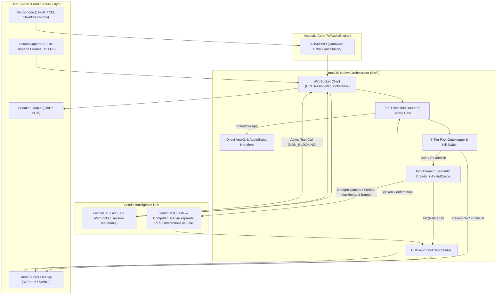

# Clicky — Voice-First AI Cursor for macOS: System Design Specification

**Document:** System Design & Architecture Specification  
**Project:** Clicky (`clicky`)  
**Target Event:** CraftVerse 2.0 Hackathon (PCCOE&R Pune), Agentic AI Track  
**Date:** October 5, 2026  
**Status:** Revision 3 — validated against 5 independent research passes (latency, competitive, accessibility, positioning, adversarial errata). Changes: protocol corrections, local-first barge-in, hardened confirmation/injection gates, precise persona, measured-not-claimed numbers. Implementation plan deferred until sign-off on this revision.

---

## 1. Executive Summary & North Star

### 1.1 The North Star
> **Clicky is an accessibility- and Indic-first, shared-control AI cursor for macOS: a co-pilot that turns natural conversational speech in English, Hindi, and Marathi into direct operating system actions—real-time conversational steering, a sub-150 ms local stop, an explainable "Ghost Cursor" preview before irreversible actions, and bilingual spoken confirmation, for people who cannot comfortably use a mouse.**

### 1.2 The Problem & Strategic Wedge
*   **The User (precise scope):** adults with **clear speech and upper-limb limitation** who work on macOS — RSI/CTS sufferers in India's ~5.4M IT workforce (34–74% report work-related musculoskeletal strain), one-handed users, spinal-cord-injury and post-stroke users with intelligible speech. All figures verified in Research Report 04 / Validation 03.
*   **Explicit non-goals (honesty first):** severe dysarthria, anarthria and aphasia are **out of scope for voice control** (speech-only interaction would exclude them); the product is **voice-first, not voice-only** — a text-command box and keyboard/switch-accessible confirmations are fallbacks (Section 4.4).
*   **The Market Gap:**
    *   *Assistive Hardware* (GlassOuse ₹60,099; Tobii Dynavox ₹2,00,000–₹7,00,000+) is priced out of reach.
    *   *Assistive Software* is rigid or abandoned: Apple Voice Control has **no Hindi/Marathi control** even on macOS 27; Talon demands weeks of script learning; Dragon exited macOS in 2018.
    *   *Frontier Computer Use* (Claude Desktop / Codex) is **autonomous batch tooling by design** — 3–6 s per vision step, background execution on macOS, and **no published mechanism for spoken per-action confirmation or in-flight cancellation at the hardware-event level**. ChatGPT Voice is full-duplex but its connected-app approvals require **on-screen clicks** ("spoken approval is not supported"), and interrupting speech does not cancel backend work.
*   **The Winning Edge:** **Shared Control.** Clicky keeps the user in command of every consequential action: full-duplex voice with a **local-first barge-in** (playback + execution queue stop, target <150 ms), **AX-first execution** (warm native app: execution leg p50 25–45 ms, p95 <300 ms), a **Ghost Cursor** that previews the literal element before it is actuated, and **spoken confirmation for irreversible actions** (Section 4.4).

---

## 2. Competitive Positioning Matrix

*Baseline verified 2026-10-05 (Validation Report 02). Frontier agents run **3–6 s per vision step (25–50 s per 10-step task)**. Claude/Codex run in background windows on macOS — the differentiator is not "screen takeover", it is **where control, consent and cancellation live**: at the hardware event, spoken, locally.*

| Dimension | Apple Voice Control | heyclicky (commercial) | Claude/Codex computer use | **Clicky (Our System)** |
| :--- | :--- | :--- | :--- | :--- |
| **Primary Interaction** | Rigid syntax / numbered grid ("click 14") | Chat + voice follow-ups, agent approvals via cards | Autonomous batch task; full-duplex voice steering (ChatGPT) | **Full-duplex voice steering + local-first barge-in** |
| **System Action** | Local AX commands | Native background driver | Vision/computer-use loop (background on macOS) | **Tri-Tier: AX Tree → Direct API → Vision** |
| **Latency** | ~0.1–0.3 s per command | Not published; cloud round-trips | 3–6 s per step | **Voice turn ~0.6–1.0 s typical; execution leg p50 25–45 ms / p95 <300 ms warm AX; local stop <150 ms (targets, measured live — §4.5)** |
| **Indic control** | **None** (no Hindi/Marathi control on macOS 27) | None | Claude voice: Hindi conversation, no Marathi; no Indic desktop actions | **Hindi/Marathi/Hinglish speech → desktop actions with a voice gate** |
| **Consent & cancellation** | Manual undo | Voice approvals; floating cursor removed 2026-09-24 | Approval at task/UI layer; interrupting speech does not cancel backend work; cancellations not published per-event | **Ghost Cursor preview + spoken per-action confirm + local cancel (<150 ms target)** |
| **Cost per 3-min task** | Free (on-device) | $20–$100/mo + message caps | Pro/Max subscription; benchmark runs ≈$8+/task | **≈₹2.4–3.6 AX-first (≈₹0.8–1.2/min), measured; Jan 2027 Gemini repricing disclosed** |
| **Accessibility design** | OS-native, trusted, free | Generalist | None specific; approval flows are click-driven | **Core audience; hands-free end-to-end; text/switch fallbacks** |

> **Naming note:** "Clicky" collides with Farza Majeed's OSS project (`farzaa/clicky`) and commercial `heyclicky.com` (25k+ users). Handle it in the **first 10 seconds** with a disambiguation slide; keep the working name for the hackathon, rebrand before any paid pilot (Section 8). The OSS repo is pointer-only; the commercial product is English-first with no on-screen preview cursor since 2026-09-24.

> **Claims discipline:** we do **not** claim to out-generalize frontier agents (short OSWorld tasks ≈85%; long-horizon binary completion ≈32%). We claim to **out-control** them for users who cannot use a mouse: spoken consent, local cancellation, Indic action mapping, AX-first cost/privacy. All speed/cost numbers are **architecture targets until the on-screen meter measures them** (Section 7).

---

## 3. High-Level System Architecture



**Architecture notes (read before §4):**
1.  Tier 3 is a **separate REST call**. The Live session (`gemini-3.8-live`) cannot execute the computer-use loop; the client captures one frame, sends it to `gemini-3.8-flash` via the REST Interactions API (`{"type": "computer_use", "environment": "desktop"}`), and executes the returned normalized coordinates locally. Every Tier 3 call sets `store: false`.
2.  The cloud provides **intent and grounding only**. It can never post a hardware event; the local RiskGatekeeper and EventSynthesizer are the only path to the OS.
3.  Cursor animation, confirmations, cancellation and safety decisions are **100% local**.

---

## 4. Component Deep-Dive

### 4.1 Audio & Multimodal Gateway (Gemini 3.8 Live)

*   **Model & endpoint:** `models/gemini-3.8-live` (model Stable; Live API surface in preview) over `wss://generativelanguage.googleapis.com/ws/google.ai.generativelanguage.v1beta.GenerativeService.BidiGenerateContent`. Verify key entitlement on day 0 (Spike 1). **Fallback warning:** `gemini-3.1-flash-live-preview` does **not** support async function calling — its tools block speech until `toolResponse`. If the primary model is unavailable, use **local mock mode** (replay cached tool calls through the real AX/CGEvent path) for the demo, not the 3.1 fallback.
*   **Wire format (corrected):** audio and video are sent as blobs — `{"realtimeInput": {"audio": {"data": "<base64 PCM>", "mimeType": "audio/pcm;rate=16000"}}}` and `{"realtimeInput": {"video": {"data": "<base64 JPEG>", "mimeType": "image/jpeg"}}}`. The old `mediaChunks[]` field is **deprecated**: multiple entries are dropped (only the first is processed), which silently breaks audio. Send **one blob per 20–40 ms** (100 ms is the tolerated ceiling, not the target).
*   **VAD (the #1 latency setting):** keep server auto-VAD on, but run a **client-side end-of-speech detector** (energy/RMS, ~250–350 ms silence) and send `audioStreamEnd` to bypass the server's ≈800 ms default silence wait. Configure `silenceDurationMs` ≈350–500, `startOfSpeechSensitivity` HIGH, `prefixPaddingMs` 20–40. Validate against multi-clause Hinglish commands; raise silence if accuracy degrades.
*   **Authentication:** demo build reads `GEMINI_API_KEY` from the environment. Production path: backend-minted ephemeral tokens via `POST /v1beta/auth_tokens` (`liveConnectConstraints` pinning model + system instruction) and the **`v1beta`** constrained endpoint. Token lifetimes are defaults (60 s start / 30 min), **not caps** (both settable to <20 h). Never embed long-lived keys in a shipped binary.
*   **Session lifecycle (implement before the demo):**
    *   Enable `contextWindowCompression: { slidingWindow: {} }` — without it, audio-only sessions cap at 15 min, audio+video at 2 min. (Compression causes a transient latency spike; keep `triggerTokens` high enough to avoid mid-demo compression.)
    *   Enable `sessionResumption: {}` and cache **only `resumable == true` handles** (the field is empty otherwise; resumption during generation/function calls loses the in-flight turn). Handles valid ~2 h after last session termination.
    *   The server sends `goAway { timeLeft }` before the ~10-minute hard WebSocket drop. Reconnect with the cached handle before `timeLeft` expires. Define a reconnect **state machine**: `setupComplete` timeout, close-code handling, exponential backoff, resumption-failure fallback to a fresh session (with a spoken "reconnecting" notice and a UI state dot), and what happens to queued tool calls when the socket drops (fail-closed: clear and announce).
*   **Tool semantics:** declare action tools with `behavior: "NON_BLOCKING"` so speech never stalls. `scheduling` ∈ `SILENT | WHEN_IDLE | INTERRUPTED` (enum spelling: `INTERRUPTED`), only honored on non-blocking calls. Use `SILENT` for mechanical actions, `WHEN_IDLE` for spoken outcomes, `INTERRUPTED` for failures. Handle `toolCallCancellation { ids }` on barge-in and drop matching queued actions locally — non-blocking calls already dispatched may not be cancellable server-side.
*   **Proactive audio is always on** in Gemini 3.8 Live (the model may choose not to respond; listening time is billed). The system instruction must say: *always respond to a direct command, even with a 2–4 word acknowledgement*, and open with a short filler ("Haan, dekhta hoon") before tool calls.
*   **Audio formats:** input 16 kHz, 16-bit linear PCM mono (resample client-side); model output 24 kHz PCM mono to `AVAudioPlayerNode`.
*   **AEC (corrected constraints):** enable VoiceProcessingIO **before `audioEngine.start()`** (engine must be stopped; enabling one node enables both; input/output formats must match). The "44.1/48 kHz requirement" is community-reported, not documented — read the actual node formats after enabling and resample to 16 kHz for the wire. If AEC convergence leaks (false barge-in), fall back to a software gate that drops mic packets while speaker RMS is above threshold during the first ~300 ms of playback. Handle `AVAudioEngineConfigurationChange` (device switch) and re-negotiate formats.
*   **Multilingual grounding:** English, Hindi, Marathi, Hinglish via native acoustic tokenization (99 languages supported; no language flag — dynamic identification). Do not hardcode a language.
*   **Activation model (missing before; now explicit):** the session is **not always-listening**. Session starts via menu-bar toggle or a global hotkey (default `Cmd+Shift+Space`), ends on toggle, on 90 s idle, or on kill switch. A visible listening indicator (menu bar waveform) is mandatory; mic is off when idle. This bounds audio cost (≈₹0.43/min input) and satisfies privacy expectations.

### 4.2 The Tri-Tier Execution Hierarchy
Clicky avoids the massive latency and token cost of vision-only models by executing across three progressive tiers:

```
[User Request]
       │
       ▼
┌────────────────────────────────────────────────────────┐
│ Tier 1: AXUIElement Semantic Control (warm: 25–45ms)   │
│ - Focused window only; batched attribute fetches       │
│ - Fed by the AXHotCache (Section 4.5)                  │
│ - Works on Notes, Safari, Mail, System Settings        │
└───────────────────────┬────────────────────────────────┘
                        │ (If element is missing / unmapped)
                        ▼
┌────────────────────────────────────────────────────────┐
│ Tier 2: Direct AppKit & URL/Script Handlers (<100ms)   │
│ - Deep links, AppleScript, NSWorkspace actions         │
│ - Fast app switching, tab opening, system triggers     │
└───────────────────────┬────────────────────────────────┘
                        │ (If custom canvas / WebGL / Figma)
                        ▼
┌────────────────────────────────────────────────────────┐
│ Tier 3: ScreenCaptureKit + Computer Use (1.5–3 s)      │
│ - ONE on-demand frame (SCScreenshotManager), self-     │
│   windows excluded, downscaled to ≤1024×768 JPEG       │
│ - gemini-3.8-flash REST Interactions API call with     │
│   enable_prompt_injection_detection; store:false       │
│ - Handle safety_decision; normalized coords →          │
│   CoordinateMath (unit-tested) before any CGEvent      │
│ - Frame tokens: estimate ~258/frame; read real counts  │
│   from usageMetadata (mediaResolution changes it)      │
└────────────────────────────────────────────────────────┘
```

#### Optimization Rules for macOS AX (corrected):
1.  **IPC Defense:** call `AXUIElementSetMessagingTimeout(AXUIElementCreateSystemWide(), 0.25)` **once at startup** to set the timeout process-wide for the AX connection (per-element wrapping is not equivalent). Expect `kAXErrorCannotComplete` (-25204) on stalls.
2.  **Scope discipline:** crawl the focused window only — depth ≤ 5, ≤ 2000 nodes; ignore off-screen/virtualized nodes. Batching is per-element: a full flatten still costs ~1 IPC call per node, so the "rebuild < 20 ms" target applies to the **visible subtree**, not deep trees; measure and degrade gracefully.
3.  **Electron & Chromium Enablement:** Electron apps (VS Code, Slack, WhatsApp) need `AXManualAccessibility = true` (Electron PR #10305); Chrome/Chromium uses `AXEnhancedUserInterface = true`. Tree wake-up takes 50–200 ms *(unverified; measure per app)* — retry once after 150 ms before declaring a miss, and **restore the attribute if Clicky set it**.
4.  **Unicode Keystroke Dispatch (corrected):** `keyboardSetUnicodeString` processes a **maximum of 20 UTF-16 code units per event**; chunk at ≤20 units without splitting surrogate pairs. Some app frameworks ignore the Unicode string and use the virtual keycode — therefore: verify the field content after entry, and fall back to pasteboard + `Cmd+V` or AX value setting. Never attempt this inside secure fields (Tier 5).
5.  **Coordinate integrity:** AppKit ↔ CoreGraphics ↔ ScreenCaptureKit ↔ normalized-vision conversions all pass through one unit-tested module. A single y-flip or Retina-scale bug is the documented #2 time-sink (Research Report 03 §5.2).
6.  **Secure input awareness (precise):** when `IsSecureEventInputEnabled()` is true, keyboard event taps are blinded to secure keystrokes and keystroke injection into secure fields is blocked; **do not assume mouse clicks are blocked**. Detect the condition, hand control back with a spoken notice if the target is a secure field, and log which rule fired.

### 4.3 Ghost Cursor & Spatial Overlay
*   **Window Architecture:** Non-activating, transparent, borderless `NSPanel` at `.screenSaver` level, with `collectionBehavior = [.canJoinAllSpaces, .stationary, .fullScreenAuxiliary]`, `hidesOnDeactivate = false`, `canBecomeKey = false`, `canBecomeMain = false`, and `ignoresMouseEvents = true` **set once in `init` and never touched** (the "invisible glass wall" failure mode). Exactly one overlay instance per `NSScreen`, **pre-created at launch** (lazy creation adds 50–200 ms and breaks the execution-leg budget), rebuilt on display changes.
*   **Capture hygiene:** overlay windows are excluded from ScreenCaptureKit capture (exclude by `CGWindowID` queried at capture time) so the model never sees the ghost cursor itself.
*   **Behavior:** hardware-accelerated SwiftUI; **speculative motion** — the cursor starts its trajectory the moment a tool call arrives, often before the model finishes speaking.
*   **Visual States & Accessibility:** all states also expose an accessible element (VoiceOver-readable confirmation pill) and the confirmation card is reachable by keyboard/switch — voice-first, not voice-only.
    *   *Default / Moving:* Smooth Bézier animated blue pointer trailing the AI's intended focus.
    *   *Review State (Reversible Action):* Amber bounding box around the target button.
    *   *Ghost Confirmation State (Irreversible / Critical Action):* High-visibility pulsing red bounding box with a translucent ghost pointer resting on the target. Hardware events are blocked until spoken confirmation.
    *   *Stopped State:* Green "Clicky stopped" banner after a kill-switch trigger or confirmation timeout.

### 4.4 5-Tier Risk Gate, Confirmation & Emergency Kill Switches

**Authority:** classification and confirmation are enforced **locally** in Swift against the target's AX role/subrole/title and action semantics. The model can *request* actions; it can never lower a tier or bypass the gate.

*   **5 Action Tiers:**
    1.  *Tier 1 (Read / Inspection):* Autonomous. Reading text, finding elements, inspecting windows.
    2.  *Tier 2 (Reversible Navigation):* Autonomous with live narration. Clicking tabs, scrolling, opening folders, switching apps. **Actions that can move data off-device (URL navigation with parameters, typing into browser/web fields, form submits) are reclassified Tier 3+** (injection containment, below).
    3.  *Tier 3 (Irreversible Actions):* **Ghost Cursor Gated.** Sending emails, deleting files, submitting forms, closing unsaved documents. Confirmation must **name the action and target** ("Delete note 'Project'. Say *Haan* to confirm, or *Ruko* to cancel") — never a bare yes/no. Negation is accepted at any time. Deletions route through `NSFileManager.trashItem` (recoverable).
    4.  *Tier 4 (Financial / Critical):* **Hard Stop + spoken read-back.** The exact action and amount are read back ("About to confirm payment of ₹500 — say *Confirm ₹500*"), then accepted only if: (a) the **echo gate** is clear (server TTS fully ended; no speaker overlap), (b) a **local transcript/number normalization** matches the expected amount exactly (`₹500` / "paanch sau" / "५००" normalize to the same value — never model judgment), and (c) a mandatory 3-second lock has elapsed. **No hardware input is required** (optional shortcut for keyboard users). Demo financial flows on sandbox pages only.
    5.  *Tier 5 (Prohibited):* **Kernel-level reject.** macOS security settings, `sudo`/Terminal execution, Keychain, credential fields. If Secure Event Input is active: speak a hand-back notice and stop.
*   **Confirmation protocol (corrected):** pending actions expire after **8–10 s** (not 5 s; the audience may speak slowly) — the timer **starts after the prompt's `turnComplete`**, pauses while user speech is detected, announces an imminent timeout, and is user-adjustable (WCAG 2.2.1). A **≥500 ms arm window** separates confirmation from hardware execution; during the window the **target element is re-resolved** (role/subrole/title/window still match) and the interruption flag re-checked. Fail-closed if anything changed (TOCTOU). Already-posted Tier 2 actions cannot be undone — this is why egress actions are Tier 3+.
*   **Dual kill switch (local-first):**
    *   *Voice stop:* **on-device keyword spotting** ("Stop", "Ruko", "Thamba", "Cancel") on the mic stream is the primary trigger for destructive actions — do not wait for a server round-trip. Local VAD onset stops playback and clears the queue (target **<150 ms**). The server `interrupted` frame (150–400 ms, RTT-bound) is confirmation, not the trigger. The reverse path (data) is the shell of this.
    *   *Hardware hotkey:* `Cmd + Shift + X` via Carbon `RegisterEventHotKey` (Carbon *does* allow zero modifiers since 10.3, but modifier-less keys globally shadow that key — use the chord). Optional double-tap-Escape via a listen-only `CGEventTap` (needs Input Monitoring). On trigger: clear queue, release held synthetic modifiers and post mouse-up (no stuck drags), show banner (target <20 ms).
*   **Prompt-injection containment (structural, corrected):** on-screen text is data, never instructions — but "voice-only command channel" is **not** sufficient, because a poisoned page can drive the model to issue tool calls that Tier 1–2 would auto-execute. Therefore:
    1.  **Intent ledger:** every tool call must be bound to a user-issued intent recorded from the voice channel; calls not traceable to an intent are refused.
    2.  **Egress tiering:** any action that can move data off-device (URL navigation with parameters, typing into web fields, form submission, clipboard writes) is Tier 3+ with spoken confirmation.
    3.  **URL allowlist** for navigations; unknown domains require explicit user voice approval.
    4.  **Computer Use** calls set `enable_prompt_injection_detection: true` and honor `safety_decision`.
    5.  **T10 pass criterion** is "no tool call executed for instructions originating in screen content" — not "the model refused".
*   **Runaway protection:** per-turn action budget, duplicate tool-call-id de-duplication, action rate limiting, repeated-failure circuit breaker (escalates to kill switch).
*   **Rollback:** inverse action stack (depth 20): text edits roll back via synthetic `Cmd + Z`; deletions via `~/.Trash` restore; unintended app launches terminated. (Optional stretch: hash-chained local audit log.)
*   **Privacy & DPDP compliance (corrected):**
    *   Credential detection checks the **AX subrole** `AXSecureTextField` (`kAXSubroleAttribute`), not the role; plus fallback heuristics (title/placeholder containing password/PIN/OTP, `AXProtectedContent`), because Electron/web custom fields may expose nothing correctly.
    *   Vision frames get black-box redaction over password/PII bounds; vision is disabled by default for windows whose titles match Bank / Checkout / Payment / Password **including Devanagari titles**, unless the user grants 60 s of explicit visual access.
    *   Every Tier 3 Interactions call sets `store: false` (default retention is 55 days on paid tier — asserting this is mandatory, not optional). Frames are never written to disk; trilingual consent notice on first run, with withdrawal.

### 4.5 Latency Budget — Measured, Not Claimed (validated)

**How the claim is stated (use these anchors with judges).** Latency is reported in three separately-measured legs; the on-screen meter shows the same anchors (Validation Report 01):

| Leg | Corrected number | Basis |
| :--- | :--- | :--- |
| **Voice turn (strict)** — last speech sample → first audio out | **~0.6–1.0 s typical with hybrid VAD; 450–550 ms best case; 1.15–1.55 s at defaults; ≤2.0 s p95 on venue Wi-Fi; first turn +200–500 ms** | Independent measurements + VAD configuration (RR01). Human perception: <400 ms natural; we **mask** the remainder. |
| **Execution leg** — `toolCall` frame → action + overlay in motion | **warm native AX: p50 25–45 ms, p95 <300 ms (target); cold Chromium/Electron: 150–450 ms, fallback budget ≤500 ms** | Cache audit (RR01 §2.2). Requires speculative crawl on voice onset. |
| **Barge-in (local stop)** — user begins "Ruko" → playback stopped + queue cleared | **<150 ms target (on-device path)**; server generation cancel 150–400 ms (secondary, disclosed) | Local VAD + player stop (RR01 §2.3). |

**Perceptual masking is the real "live feel" engine:** instant visual acknowledgement on VAD onset (<100–150 ms), speculative ghost-cursor motion at `toolCall` arrival (often before speech ends), model-side fillers ("Haan, dekhta hoon"), and silent execution with `WHEN_IDLE` narration. Users forgive a 700–900 ms spoken reply they can see acknowledged.

**Execution leg budget:**

| Segment | Budget | Mechanism |
| :--- | :--- | :--- |
| `toolCall` frame → router dispatch | < 5 ms | Non-blocking receive loop; never await AX inside it |
| Element resolution | < 20 ms warm | AXHotCache RAM lookup; speculative crawl on VAD onset |
| Risk classification | < 1 ms | Local 5-tier gate; the LLM never decides safety |
| Action execution | < 10 ms native | `AXUIElementPerformAction` / `CGEvent.post` |
| Ghost-cursor animation kickoff | ≤ 16 ms (first frame @ 60 FPS) | Pre-created per-screen panels; SwiftUI spring |
| **Execution leg total** | **warm p50 25–45 ms / p95 <300 ms; cold ≤500 ms** | |

**AXHotCache mechanics:**

1.  **Observe, don't poll.** `AXObserver` subscribes to `kAXFocusedWindowChangedNotification`, `kAXWindowCreatedNotification`, `kAXUIElementDestroyedNotification`, and `kAXFocusedUIElementChangedNotification` on the frontmost application (per-app observer; some apps emit sparsely; structure changes only, not value/text).
2.  **Flatten once.** Focused window → in-RAM `CacheKey → CacheEntry` map. `CacheKey` = normalized `(AXRole, AXSubrole, AXTitle, AXDescription)`; `CacheEntry` = element ref, global top-left `CGRect`, enabled flag, actions. Caps: depth 5, 2000 nodes, visible subtree first; global AX timeout 0.25 s (Section 4.2).
3.  **Invalidate cheaply.** Notifications mark dirty; 100 ms debounce; **speculative crawl on voice onset and app activation** keeps the cache warm before the tool call lands.
4.  **Revalidate before acting.** Every Tier 3+ action re-resolves its target during the arm window (TOCTOU, Section 4.4).
5.  **Never block the UI.** All AX work on dedicated serial actors — never `@MainActor`.

### 4.6 Sixty-Second Zero-Config Setup (corrected for TCC)

The demo machine goes from checkout to a working voice click without Docker/Python/Node. **The demo path is the `.app` bundle, not `swift run`** (a bare SwiftPM executable cannot carry `LSUIElement` or usage descriptions, and macOS kills mic access without them):

1.  `swift build -c release` → `scripts/make-app.sh` assembles `build/Clicky.app` (Info.plist: `LSUIElement`, `NSMicrophoneUsageDescription`, `NSAppleEventsUsageDescription`) → sign → `open build/Clicky.app`. `swift run` is a developer-only shortcut for unit work.
2.  **Signing (corrected):** create the persistent self-signed **Code Signing** identity once via Keychain Access → Certificate Assistant (or the openssl `pkcs12` + `security import` recipe); `security create-certificate` does **not** exist. Sign the **bundle** with a fixed identifier (`codesign --force -s "Clicky-Dev" -i com.clicky.mac Clicky.app`). **Caveats:** the designated requirement includes the leaf certificate; regenerating, replacing or expiring the certificate destroys every TCC grant. Fixed bundle ID, unchanged entitlements, never re-create the cert.
3.  **One secret.** `GEMINI_API_KEY` in the environment (or Keychain) — no backend for the hackathon.
4.  **First-run permission wizard:** checks `AXIsProcessTrusted()`, `CGPreflightScreenCaptureAccess()`, mic authorization; deep-links to the exact System Settings panes; states the **restart requirement** for Screen Recording; pre-triggers the per-app Automation prompts so they don't fire mid-demo; runs a runtime permission watchdog (detects revocation, speaks a recovery notice).
5.  **Pre-flight doctor:** certificate present, bundle signed, permissions granted, API key valid, mic present, network reachable, `doctor.sh` before every run.

---

## 5. Technology Stack & Project Structure

*   **Language & Runtime:** Swift 6 / AppKit / SwiftUI (macOS 14.2+ target; demo OS verified at build time — current SDK is macOS 26).
*   **Packaging:** Non-sandboxed menu-bar application (`LSUIElement = true`), persistent local signing (Section 4.6).
*   **Network & Streaming:** `URLSessionWebSocketTask`; correct Live wire format (Section 4.1); no third-party SDK.
*   **Audio Pipeline:** `AVAudioEngine` + VoiceProcessingIO + `AVAudioConverter` (48→16 kHz in, 24→48 kHz out).
*   **System Control:** `ApplicationServices` (`AXUIElement`), `CoreGraphics` (`CGEvent`), `ScreenCaptureKit` (14.0+ APIs only).
*   **Testing:** XCTest via SwiftPM. Pure logic (coordinate math, risk classification, protocol models, matching, cost math, confirmation transcripts) is unit-tested; OS integrations have explicit manual verification procedures.

### Proposed File Layout
```
clicky/
├── Package.swift
├── Resources/Info.plist
├── scripts/                              // sign-dev.sh · make-app.sh · doctor.sh · run.sh
├── Sources/
│   ├── ClickyApp/                        // LSUIElement entry, menu bar, onboarding
│   │   ├── main.swift
│   │   ├── AppDelegate.swift
│   │   └── AppState.swift
│   ├── ClickyCore/                       // Shared models, coordinate math, permissions, telemetry
│   │   ├── CoordinateMath.swift
│   │   ├── Permissions.swift
│   │   └── LatencyMeter.swift
│   ├── ClickyGemini/                     // Live WebSocket client + protocol + tool router
│   │   ├── GeminiProtocolTypes.swift
│   │   ├── GeminiLiveClient.swift
│   │   └── ToolRouter.swift
│   ├── ClickyAccessibility/              // AX crawler, hot cache, app adapters
│   │   ├── AXTreeCrawler.swift
│   │   ├── AXHotCache.swift
│   │   └── AXAppAdapters.swift
│   ├── ClickyInput/                      // CGEvent synthesis, kill switch, secure input
│   │   ├── EventSynthesizer.swift
│   │   ├── KillSwitchManager.swift
│   │   └── SecureInputGuard.swift
│   ├── ClickySafety/                     // 5-tier classification + pending-action gate
│   │   ├── RiskGatekeeper.swift
│   │   ├── PendingActionGate.swift
│   │   └── IntentLedger.swift
│   ├── ClickyAudio/                      // AVAudioEngine + AEC + PCM conversion + local VAD
│   │   ├── AudioStreamEngine.swift
│   │   └── LocalVAD.swift
│   ├── ClickyVision/                     // On-demand single frame capture
│   │   └── ScreenCapturer.swift
│   └── ClickyOverlay/                    // Per-screen panels + ghost cursor
│       ├── OverlayWindowController.swift
│       └── GhostCursorView.swift
└── Tests/
    ├── ClickyCoreTests/
    ├── ClickySafetyTests/
    ├── ClickyGeminiTests/
    ├── ClickyAccessibilityTests/
    ├── ClickyInputTests/
    └── ClickyAudioTests/
```

---

## 6. Hackathon Live Demo Script (3-Minute Winning Arc)

1.  **Minute 0:00–0:45 | The Hook & The Problem:**
    *   Show a team member with their hands resting on the table.
    *   *Speaker:* "5.4 million people in India live with motor disabilities; up to 70% of engineers report RSI. Existing eye-trackers cost ₹60,000+. Voice Control has no Hindi or Marathi. And today's AI agents are autonomous by design — their approvals are clicks and their interruptions don't cancel work. Watch Clicky."
2.  **Minute 0:45–1:45 | The Speed & Indic Voice Edge:**
    *   *Action:* Speaker says in Hindi/English: *"Clicky, Safari kholo, Wikipedia pe Pune search karo aur pehla paragraph Notes app mein paste kar do."*
    *   *Result:* Sub-second voice response; blue cursor slides across Safari, grabs the text via native AX, switches to Notes, pastes. Meet the meter: voice turn and execution leg shown live.
3.  **Minute 1:45–2:30 | The "Shared Control" & Ghost Cursor Wow Moment:**
    *   *Action:* User says: *"Delete my project notes."*
    *   *Result:* Clicky highlights the Delete button with a pulsing red box. The **Ghost Cursor** stops.
    *   *Gemini speaks in Hindi:* *"Yeh note Trash mein chala jayega — recover ho sakta hai. Aage badhoon? 'Haan' boliye, ya 'Ruko'."*
    *   *User says:* *"No, cancel that!"*
    *   *Result:* Cursor instantly retreats. Latency meter shows **< 150 ms local stop** (server cancel shown separately, honestly).
4.  **Minute 2:30–3:00 | The Closer:**
    *   Display live telemetry: 0 images streamed (Tier 1 AX victory — frames are fallback-only), task cost measured live (target under ₹4 for the arc).
    *   *Conclusion:* "Not a black box, not a batch job — a fast, safe, multilingual hands-free co-pilot that keeps you in control."

**Demo insurance (Research Report 06 §7C + Validation 01):** dedicated 5G hotspot with auto-switch; **local mock mode wired to the real AX/CGEvent path** (not the 3.1 fallback); uncut pre-recorded backup video showing the same meter; pre-warm the session before the audience; `doctor.sh` before every run; one rehearsal of the Sequoia-style permission flow.

---

## 7. Evaluation & Evidence Plan (Judge-Proofing)

Winning requires proof, not claims. Evidence engine = **10-task desktop benchmark suite** (full table: Research Report 05 §2), run as a controlled 3-arm comparison:

| Arm | Setup | Purpose |
| :--- | :--- | :--- |
| **1. Manual (simulated one-handed)** | Dominant hand restrained | Human baseline, constraint-only simulation (labeled as such) |
| **2. Vision-only agent** | Screenshot-loop baseline | Latency/cost gap |
| **3. Clicky** | AX-first + voice + Ghost Cursor | Subject |

**Tasks (abridged):** T01 Notes dictation · T02 Clock timer · T03 Safari search · T04 Marathi music playback · T05 Khata row entry · T06 GST calculation · T07 WhatsApp order confirmation (gated) · T08 Mandi-price lookup · T09 Delete folder → **verify it lands in `~/.Trash` (reversible)** · T10 **Adversarial prompt-injection refusal** (pass criterion: no tool call executed for content-originated instructions).

**Metrics:** Task Success Rate (OS-state-verified); wall-clock completion; **voice-turn p50/p95 and execution-leg p50/p95 from the meter**; **local stop latency (target <150 ms)**; **0% unconfirmed destructive actions over ≥20 trials**; cost per task in ₹ at official rates (audio in ≈₹0.43/min, out ≈₹1.53/min, text in $0.75/1M; recompute all Report 05 estimates — its INC math was corrected in validation). Label anything unmeasured "architecture target".

**Deliverables for the PPT:** 4 charts (success rate, completion time, ₹/task, stop latency) + the 15-second T10 refusal recording + the protocol so judges can re-run. If n is small (only us), say so on the slide.

**Business evidence targets (positioning, Validation 04):** 2 signed pilot LOIs + 1 written budget-line confirmation before judging (HEIs, employers, NGOs); pricing anchor ₹49,999/10-seat/6-month pilot (validate), Pro ₹499/mo (₹249 student); never project revenue without a receipt.

---

## 8. Implementation Handoff

1.  **Implementation plan:** to be written next (invoke the `writing-plans` skill) once this revision is signed off. It translates every component into bite-sized TDD tasks with exact file paths, including the corrected protocol shapes, VAD tuning, signing recipe, and intent ledger.
2.  **Build order:** foundation (package/menu bar/coordinates/permissions/signing) → Gemini Live client (correct wire format + VAD + resumption) → AX engine + input synthesis → safety/audio/overlay → integration + demo hardening.
3.  **Build exit criteria (prototype "done"):**
    *   Hands-free end-to-end: spoken command → AX action works 5/5 runs on Notes, Safari, Calculator.
    *   Execution leg **p50 ≤150 ms and p95 <300 ms warm**, measured over ≥50 tool calls; cold fallback ≤500 ms.
    *   **0 unconfirmed Tier 3–5 actions across 20 trials**; local stop <150 ms on command.
    *   Fresh machine → running demo <60 s excluding permission clicks.
4.  **Scope-cut ladder (if behind at hour 18):** vision fallback first, then Marathi tuning, then Tier-2 AppleScript handlers. **Never cut:** Ghost Cursor overlay, voice-triggered AX click, spoken confirmation gate, local stop path.
5.  **Open decisions (owner: user):**
    *   **Branding:** keep "Clicky" + disambiguation slide for the hackathon; rebrand before the first paid pilot (recommendation: qualifier name, e.g., "Clicky Live").
    *   **Evidence sprint:** 10 outreach calls for pilot LOIs (Validation 04) — decides the payer slide.
    *   **Tier 4 demo scope:** sandbox payment page only — never a real payment flow.
    *   **Persona validation:** one interview + one measured task with a clear-speech upper-limb-limited user before judging (Validation 03 protocol).
